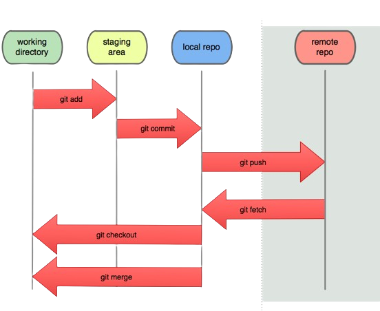
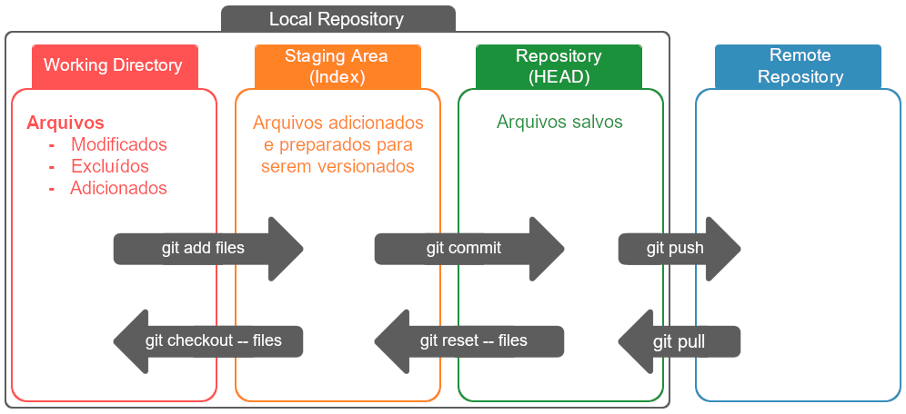
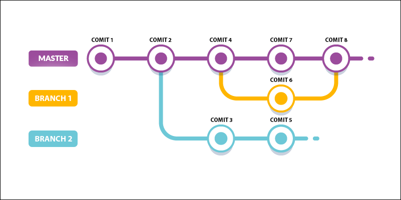
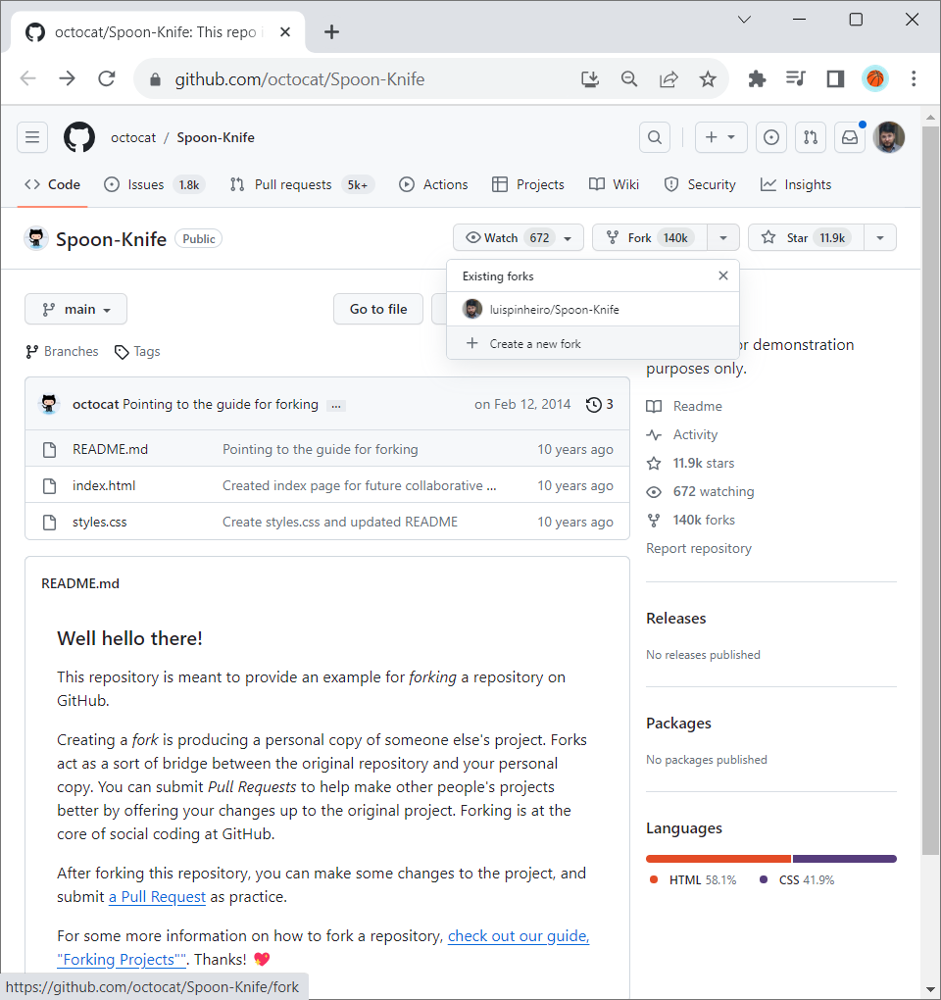
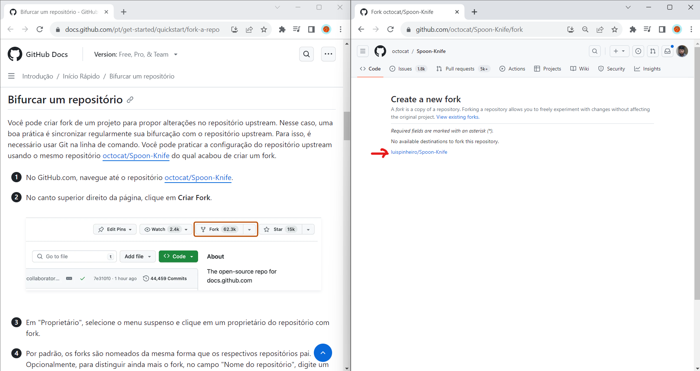

# GIT PASSO A PASSO ABAIXO:

## Ciclo de vida dos status de arquivos no Git








https://githowto.com/

## Comandos e utilitários para o GITHUB

### __Como fazer o Fork de um projeto no git__

#### __1ºPASSO__ - Criar o Fork

> Clicar em __"Fork"__ e depois __"create new fork"__



___
### __2ºPASSO__ - Acessar o Fork

> Caso deseje é possível mudar o nome do repositório clonado.



___
### __3ºPASSO__ - Escolher um diretório para clonagem

> Acessar um diretório via terminal

```
code .
```
___
### __4ºPASSO__ - Iniciar o repositório git

>> Inicializar o repositório local no computador utilize o comando abaixo

```
git init
```
___
### __5ºPASSO__ - Clonar o repositório git

>> Para clonar o repositório utilize o comando abaixo

```
git clone <link_do_repositório>
```
___
### __6ºPASSO__ - Add os arquivos untrecked files git para serem versionados no repositório git

>> Adicionar todos os arquivo untrecked file para o commit
```
git add .
```
___
### __7ºPASSO__ - Comitar os arquivos para serem versionados no repositório git

>> Comitar os arquivos e diretórios
```
git commit -m "First version"
```
___
### __8ºPASSO__ - Acessar o repositório git

>> Acessar o repositório remoto

```
git remote add <link_do_repositório>
```
